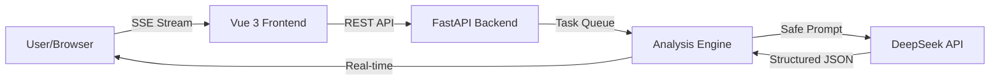

# 🛡️ DeepSeek Code Sentinel

> **An AI-Powered Code Security Audit Platform**  
> *Secure your code at the speed of thought.*

[](https://opensource.org/licenses/MIT)
[](https://www.python.org/)
[](https://vuejs.org/)
[](https://deepseek.com)

---

## 📖 简介 (Introduction)

**DeepSeek Code Sentinel** 是一个基于大语言模型（LLM）的智能代码安全审计系统。它结合了 **FastAPI** 的高性能异步处理能力与 **DeepSeek** 的深度推理能力，为开发者提供实时的代码漏洞扫描、风险评估及智能修复建议。

不像传统的静态分析工具（SAST），它不仅能发现“显式”的漏洞，还能理解代码逻辑中的“隐式”风险。

### ✨ 核心特性 (Key Features)

- 🕵️ **深度逻辑扫描**: 识别 SQL 注入、XSS、反序列化漏洞及逻辑缺陷。
- ⚡ **流式极速响应**: 采用 SSE (Server-Sent Events) 技术，分析进度实时可见。
- 🛠️ **智能修复建议**: 不仅指出问题，更提供 Diff 级别的代码修复方案。
- 📊 **可视化漏洞看板**: 基于 Monaco Editor 的沉浸式审计体验。
- 🔒 **隐私安全设计**: 内置敏感信息清洗 (Credential Scrubbing) 与 Prompt 注入防御。

---

## 🏗️ 架构概览 (Architecture)



## 🚀 快速开始 (Quick Start)

### 前置要求
- Python 3.10+
- Node.js 18+
- DeepSeek API Key

### 1. 克隆仓库
```bash
git clone https://github.com/your-username/deepseek-code-sentinel.git
cd deepseek-code-sentinel
```

### 2. 后端启动 (Backend)
```bash
cd backend
python -m venv venv
source venv/bin/activate  # Windows: venv\Scripts\activate
pip install -r requirements.txt
cp .env.example .env      # 配置你的 API Key
uvicorn main:app --reload
```

### 3. 前端启动 (Frontend)
```bash
cd frontend
npm install
npm run dev
```

访问 `http://localhost:5173` 即可开始体验！🎉

---

## 📚 文档 (Documentation)

本项目包含三份“硬核”设计文档，位于 `docs/` 目录：

1.  **[产品需求文档 (PRD)](docs/product_requirements_document.md)**: 核心功能拆解与边界场景定义。
2.  **[技术方案设计 (TDD)](docs/technical_design_document.md)**: 架构反思、接口规范与数据建模。
3.  **[开发手册 (Guide)](docs/step_by_step_guide.md)**: 分阶段步进式开发指引。

---

## 🤝 贡献 (Contributing)

欢迎提交 PR！请确保在提交前运行 `pytest` 并通过所有测试。

## 📄 许可证 (License)

本项目采用 [MIT License](LICENSE) 开源。

---

<p align="center">Made with ❤️ by Sydney (and a human)</p>
